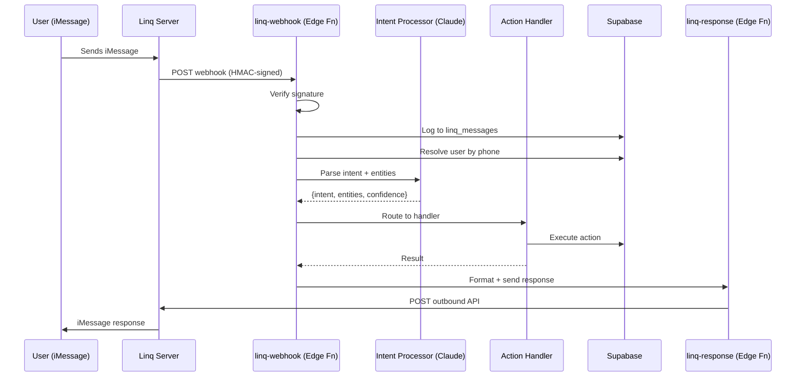

# Tryps × Linq Integration FRD

**Version:** 0.2 (Draft — Pre-Kickoff, updated with contract + research)
**Date:** March 11, 2026
**Author:** Jake Stein
**Parent Doc:** [Master FRD v1.0](/Users/jakestein/tryps-docs/specs/frd-mar10.md) (922 lines, 18 flows, ~237 screens)
**Meeting:** Architecture kickoff Friday March 14, 2026 — Jake + Asif (Tryps) + Linq (head of architecture, sales, dev team)
**Follow-up:** Dev sync Wed/Thu March 18-19 — Jake + Asif + Linq engineering (per Ray's Slack)

---

## 0. Questions for Johnny (Linq Chief Architect) — Friday Kickoff

These are the implementation-blocking unknowns. Each question targets Johnny specifically because they require architectural knowledge of Linq's internals, not sales or account info.

### Q1: Webhook Payload Schema

**Ask Johnny:** "When an iMessage comes in from a user, what exact JSON fields does your webhook POST to our endpoint? Can you share the schema or a sample payload?"

**Why we're asking:** We're building a Supabase edge function (`linq-webhook`) that parses every inbound message. We need to know the exact field names and types — especially: sender phone number format (E.164?), message body encoding, media attachment handling, and whether group chat messages include a thread/conversation identifier. Without this, we can't write the parser. Our existing Twilio webhook handler expects a specific format; Linq's will be different.

**What a good answer looks like:** A JSON sample or schema doc showing all fields, especially `from`, `body`, `conversation_id`, `media_url`, and any metadata.

---

### Q2: Group Chat Identity & Thread Mapping

**Ask Johnny:** "When our Tryps agent is in an iMessage group chat with 6 trip participants, does each message include a stable `conversation_id` or `thread_id` that uniquely identifies that group? Can we use this to map the iMessage group to a specific Tryps trip?"

**Why we're asking:** This is the single most important architectural question. Tryps users plan multiple trips with overlapping friend groups. If Sarah texts "What do I owe?" we need to know which trip she's asking about. If Linq gives us a stable group thread ID, we can map it 1:1 to a trip. If not, we have to build an AI disambiguation layer ("Which trip — Miami or Ski Weekend?") which is slower and error-prone.

**What a good answer looks like:** "Yes, every message includes a `chat_id` that's stable for the lifetime of the group thread." Or: "No, we only provide sender phone + body, no group context."

---

### Q3: Programmatic Group Creation

**Ask Johnny:** "Can our backend programmatically create a new iMessage group chat and add specific phone numbers to it? For example, when a trip organizer creates a trip with 5 friends in our app, can we auto-create an iMessage group thread for that trip?"

**Why we're asking:** The dream UX is: organizer creates trip in Tryps → iMessage group auto-appears with all participants + the Tryps agent. If Linq can't create groups, the organizer has to manually create the iMessage group and add the Tryps number, which is friction. This determines whether the integration is "magic" or "manual setup."

**What a good answer looks like:** "Yes, `POST /create-chat` with an array of phone numbers." Or: "No, the user must initiate the group and add our number."

---

### Q4: Outbound Message API

**Ask Johnny:** "When our backend needs to send a message back to a user or a group (e.g., 'You owe Jake $47.50'), what's the API call? Is it `POST /send` with a phone number? Can we send to a group thread by `conversation_id`? Can we send proactively (not just as a reply)?"

**Why we're asking:** We need to send three types of outbound messages: (1) direct replies to user requests, (2) proactive notifications (voting deadlines, expense alerts, trip reminders), and (3) group-wide announcements (text blasts). Each may require a different API pattern. Our existing `outbound_sms_queue` system queues messages for Twilio — we need to know if Linq's API is similar (REST POST) or different (response-in-webhook like TwiML).

**What a good answer looks like:** A REST endpoint spec for sending to individuals and groups, with confirmation of proactive (non-reply) sending.

---

### Q5: Burst Rate Limits

**Ask Johnny:** "Our contract says ~7K messages/line/day. But what about burst scenarios? If a trip organizer sends a 'text blast' update to 50 participants simultaneously, can we fire 50 API calls at once, or do we need to throttle? What's the per-second or per-minute limit?"

**Why we're asking:** Trip planning has bursty messaging patterns. A voting deadline triggers notifications to everyone at once. An expense logged triggers balance updates to everyone. We need to know if we should queue and drip-feed these or if Linq handles the burst natively. If there's a hard rate limit we need to build a message queue with backoff.

**What a good answer looks like:** "X messages per second sustained, Y burst. Or just send them — we handle queuing internally."

---

### Q6: Sandbox vs Production Differences

**Ask Johnny:** "What can we NOT do in the sandbox that we can in production? Specifically: can we test group chats, media attachments, webhook delivery, and outbound messages in sandbox? Is there a message limit?"

**Why we're asking:** Asif needs to build and test our webhook handler before the follow-up dev sync next week. If the sandbox is limited (e.g., no group chats, no media, no outbound), we need to know so we can plan around it. We want to demo a working end-to-end flow at the March 18-19 dev sync.

**What a good answer looks like:** "Sandbox is full-featured but limited to 100 messages/day" or a specific list of limitations.

---

### Q7: Delivery Status Webhooks

**Ask Johnny:** "After we send an outbound message, does Linq fire delivery status callbacks? Specifically: delivered, read, and failed events? What's the webhook format for these?"

**Why we're asking:** We want to show users delivery confirmation ("Message sent" → "Delivered" → "Read") and handle failures gracefully (retry via SMS if iMessage delivery fails). Our `linq_messages` table tracks `delivery_status`. Without status callbacks, we're flying blind on whether messages actually reach users.

**What a good answer looks like:** "Yes, we fire `message.delivered`, `message.read`, and `message.failed` webhooks to the same endpoint with the original message ID."

---

### Q8: Android/Non-iMessage Recipient Behavior

**Ask Johnny:** "When we send a message to a phone number that's on Android or has iMessage disabled, what happens? Does Linq auto-fallback to RCS/SMS? Does the webhook payload indicate which transport was used? Does group chat behavior change?"

**Why we're asking:** Not all trip participants will have iPhones. We need to ensure the experience degrades gracefully. If Linq falls back to SMS, group chat threading may break (SMS group chats work differently from iMessage). We need to know if we should build separate handling for Android participants.

**What a good answer looks like:** "We auto-fallback to RCS then SMS. The delivery webhook includes a `transport` field. Group chats work via MMS for non-iMessage users."

---

### Q9: Apple Platform Risk — Johnny's Honest Assessment

**Ask Johnny:** "We've read about the June 2026 Apple enforcement concern. What's your team's honest assessment? What technical or business mitigations does Linq have in place? If Apple shuts down unofficial iMessage APIs, what's the fallback path for our integration?"

**Why we're asking:** We're building a core product feature on Linq's infrastructure. We need to understand the risk to make an informed build-vs-wait decision. If Linq has a credible mitigation (e.g., becoming an official MSP, diversifying to WhatsApp/RCS), we're comfortable building. If the honest answer is "we don't know," we need to design our architecture to be transport-agnostic from day one.

**What a good answer looks like:** Johnny's honest technical assessment, not a sales pitch. What's the actual plan if Apple changes the macOS APIs?

---

## 1. Scope & Relationship to Master FRD

This is a **modular companion doc** to the master FRD. It covers the Phase 2 iMessage integration via Linq — a new input channel for existing app functionality, not new features.

**What this doc adds:**

- 6 iMessage interaction flows (L1-L6)
- Linq webhook/API contracts
- NLP intent parsing architecture
- Payment execution strategy
- Database schema additions

**What this doc references (not duplicates):**

- Three-layer architecture → Master FRD Section 2.1
- User roles and auth states → Master FRD Section 3
- All in-app screens → Master FRD Section 5, Flows 1-18
- Phase summary → Master FRD Section 4

**Core principle:** Linq adds a new entry point, not new app features. Every Linq flow maps to an existing Phase 1 flow. The iMessage thread is a remote control for the Tryps app.

---

## 2. Linq Platform Assessment

### What Linq Is

Linq is a Birmingham, AL startup (ex-Shipt founders) providing REST APIs for sending/receiving iMessage, RCS, and SMS programmatically. $20M Series A (Feb 2026, TQ Ventures). The **only SOC 2 Type II certified iMessage API**.

### How It Works

Linq sends **blue-bubble iMessages** (peer-to-peer) — NOT Apple Messages for Business gray bubbles. This is achieved via private, undocumented macOS APIs running on physical Mac hardware.

### Capabilities

| Feature                         | Supported | Notes                                           |
| ------------------------------- | --------- | ----------------------------------------------- |
| Plain text messages             | Yes       |                                                 |
| Images, video, audio, documents | Yes       | Rich media attachments                          |
| Group chats                     | Yes       | Detect, participate, rename, set icon           |
| Threaded replies                | Yes       | Reply to specific messages                      |
| Emoji reactions / tapbacks      | Yes       | Love, like, dislike, laugh, emphasize, question |
| Typing indicators               | Yes       | Inbound and outbound                            |
| Read receipts                   | Yes       | Delivery confirmation                           |
| Full-screen effects             | Yes       | Confetti, fireworks, lasers                     |
| RCS/SMS fallback                | Yes       | For Android recipients                          |
| **Buttons / carousels**         | **No**    | iMessage has no interactive widgets via Linq    |
| **Apple Pay**                   | **No**    | Requires official Messages for Business         |
| **List pickers / forms**        | **No**    | Messages for Business exclusive                 |

### Webhook Architecture

- **Real-time webhooks** (not polling)
- **HMAC-SHA256** signature verification (`X-Webhook-Signature` + `X-Webhook-Timestamp`)
- **<120ms latency**, 99.95% uptime SLA
- Events: `message.received`, `message.delivered`, `message.read`, `message.failed`, `reaction.added`, `reaction.removed`, `chat.typing_indicator.*`

### Pricing & Contract

Contract signed March 5, 2026. Per-LINE pricing (not per-message). Key terms:

- ~7,000 messages/line/day capacity (soft limit — increased latency above this)
- $99 activation fee per new line
- 90-day minimum commitment per line
- 25 active lines committed by end of 12-month term
- Dedicated Slack channel for engineering support
- 24-hour message deletion from Linq hardware
- Confidentiality clause on commercial terms
- 1-2 business days to provision new lines
- Horizontal scaling via additional lines

**Negotiation needed:** Line count and billing frequency. See agreement for tier details.

**For architecture planning:** 1 line = 1 phone number = ~7K msg/day. A single Tryps line handles ~200+ active trips at moderate messaging volume. Start with 1-3 lines (dev/staging/prod).

### Platform Risk: Apple's Posture on Unofficial iMessage APIs

Linq uses unofficial, undocumented macOS APIs to send blue-bubble iMessages. This carries real platform risk — but the often-cited "June 2026 deadline" is **unverified**.

**What Apple has actually done:**

- **Dec 2023:** Killed Beeper Mini within days of launch. Apple's statement: _"We took steps to protect our users by blocking techniques that exploit fake credentials in order to gain access to iMessage... We will continue to make updates in the future to protect our users."_ ([TechCrunch](https://techcrunch.com/2023/12/08/apple-cuts-off-beeper-minis-access-after-launch-of-service-that-brought-imessage-to-android/))
- **Ongoing:** Each macOS release tightens security (SIP, Full Disk Access for chat.db, etc.)
- **No published deadline.** The "June 2026" claim traces to a single [HackMD article](https://hackmd.io/@ZURhi6cqSnWHVFu2MCiTpg/BJJXqdqd-l) that cites a non-existent source. No Apple press release, WWDC session, or official communication confirms it.

**The real risk:** Apple doesn't announce enforcement — they just do it. A macOS update could block Linq's access method at any time, without warning. Linq survived Beeper's shutdown (different technical approach), but the threat is ongoing and unpredictable.

**Why Linq may be durable despite the risk:**

- Linq raised $20M in Feb 2026 — investors did diligence on this risk
- SOC 2 Type II certification signals institutional-grade infrastructure
- Building channel-agnostic support (WhatsApp, Telegram, Slack, Discord, RCS)
- Different technical approach from Beeper Mini (server-side Mac hardware vs protocol emulation)

**Our mitigation:** Build with a transport abstraction layer (see Section 4). Linq is one adapter; Twilio SMS already exists as a second. Future adapters: WhatsApp, RCS, official Apple Messages for Business. If Apple kills Linq's iMessage access, the agent layer keeps working — just over SMS/RCS instead of blue bubbles.

**Question for Johnny (Q9):** Ask directly about Apple risk. Get his honest technical assessment, not a sales pitch.

---

## 3. Payment Execution Strategy

### In-Thread Payment Constraint

Apple Pay in iMessage requires official Messages for Business (gray bubbles). Linq's blue bubbles cannot trigger Apple Pay sheets or interactive message types. This is a hard platform constraint — payment cannot happen natively inside the iMessage thread.

### x402 Agent Wallets — Core to Launch

x402 is the payment rail we're building the agent layer around. NOT a future-state nice-to-have — this is launch architecture.

**The end-state UX:**

```
User texts: "Book me a flight to NYC"
  → Agent searches Duffel, presents options in iMessage
User texts: "Option 1"
  → Agent hits booking API → gets HTTP 402 → x402 auto-pays from Tryps Cash
  → Booking completes autonomously
Agent posts: "Booked! JetBlue B6 123, Mar 15 SFO→JFK. $234 from your Tryps Cash."
  → Expense auto-logged, split among trip participants
```

**How x402 works technically:**

1. User pre-funds Tryps Cash wallet (Stripe → USDC on Base chain)
2. Agent hits a booking API endpoint
3. API returns HTTP 402 with payment requirements in headers
4. x402 client library auto-negotiates payment from Tryps Cash
5. API receives payment, fulfills the request
6. Settlement is sub-second via USDC on Base

**Tryps Cash = the execution wallet.** Funds agent API calls (flights, hotels, activities). Every cost is logged per-trip and fed into the expense ledger for group splitting.

**x402 protocol status (confirmed March 2026):**

| Detail             | Status                                                                                              |
| ------------------ | --------------------------------------------------------------------------------------------------- |
| Version            | **V2** (released Dec 11, 2025)                                                                      |
| Creator            | **Coinbase** (open source, May 2025)                                                                |
| Foundation         | **x402 Foundation** co-founded by Coinbase + Cloudflare (Sep 2025)                                  |
| Payments processed | **100M+** across APIs, AI agents, and web services                                                  |
| Settlement speed   | **~1.5-2 seconds** end-to-end on Base L2                                                            |
| Primary chain      | **USDC on Base** (sub-cent gas, ~200ms settlement)                                                  |
| Fiat support       | **V2 adds ACH + card networks** via CAIP standards                                                  |
| Stripe integration | **Native** — [docs.stripe.com/payments/machine/x402](https://docs.stripe.com/payments/machine/x402) |
| Corporate backers  | Coinbase, Cloudflare, Google, Visa, Mastercard, AmEx, Stripe, AWS, Circle, Anthropic, Vercel        |
| Integration time   | **15-30 minutes** for basic setup (Coinbase claims 5 min)                                           |
| Facilitator cost   | **Free for 1,000 txns/mo**, then $0.001/txn                                                         |
| Testnet            | **Base Sepolia** — free testnet USDC faucet available                                               |
| SDKs               | TypeScript (`@x402/core`, `@x402/axios`, `@x402/express`), Python, Rust                             |

**No travel API accepts x402 natively today** (Duffel, Amadeus, Sabre — none). But the proxy pattern is well-supported and straightforward:

**Tryps builds an x402 Booking Proxy:**

1. Exposes x402-enabled endpoints (`POST /flights/search`, `POST /flights/book`)
2. Accepts x402 USDC payments from Tryps agents
3. Translates to Duffel/Amadeus API calls behind the scenes
4. Agent pays in USDC → Tryps pays Duffel via standard billing

This proxy IS the agent layer. You control both sides (agent + proxy), so x402 is between your own services. The `@x402/express` middleware makes this ~1 week of integration work.

**Fiat on-ramp (user funds Tryps Cash):** Stripe → USDC on Base via Stripe's x402 integration.
**Agent wallet infrastructure:** Coinbase Agentic Wallets (managed wallets with spending limits, session caps, enclave key isolation) or Circle Developer-Controlled Wallets.

**Regulatory notes:**

- Using Coinbase's hosted facilitator offloads most compliance burden to Coinbase (licensed, regulated entity)
- Stripe adds a second compliance layer
- GENIUS Act (signed into law) requires stablecoin issuers to hold 1:1 reserves — strengthens USDC legitimacy
- No chargebacks on blockchain — need to build refund/dispute layer ourselves
- Fed watching agentic commerce — expect regulations on consent, fraud controls, spending limits

**Implementation estimate:**

- x402 SDK integration: 1-2 days
- Agent wallet infrastructure (Coinbase Agentic Wallets): 1-2 weeks
- USDC on-ramp via Stripe: 1-2 weeks (pending Stripe preview access — email `machine-payments@stripe.com`)
- x402 proxy wrapping Duffel: 1 week
- Testing on Base Sepolia: concurrent

```
                     ┌─────────────────────────┐
                     │     User's Tryps Cash    │
                     │   (USDC on Base chain)   │
                     └────────────┬────────────┘
                                  │ x402
                     ┌────────────▼────────────┐
                     │  Tryps Booking Proxy     │
                     │  (x402-enabled wrapper)  │
                     └────────────┬────────────┘
                                  │ traditional API
              ┌───────────────────┼───────────────────┐
              │                   │                   │
     ┌────────▼────────┐ ┌───────▼────────┐ ┌────────▼────────┐
     │ Duffel (flights) │ │ Hotels API     │ │ Activities API  │
     └─────────────────┘ └────────────────┘ └─────────────────┘
```

**Cost model:** Tryps eats agent costs initially. Log every cost per-trip. Eventually route to expense pool (creator pays or group splits via ledger).

### Fallback Payment Flows (Before x402 / Tryps Cash is Funded)

For users who haven't funded Tryps Cash yet or for flows where manual confirmation is appropriate:

| Approach                                    | UX Friction            | When to Use                                       |
| ------------------------------------------- | ---------------------- | ------------------------------------------------- |
| **Pre-authorized stored card (Uber model)** | Zero friction          | User has Stripe card on file + spending limit set |
| **Deep link to app → Apple Pay**            | 2 taps + Face ID (~3s) | Payment confirmation needed                       |
| **Stripe Payment Links**                    | Opens Safari, 1-2 taps | User doesn't have app installed                   |

**Pre-authorized flow (Uber model):**

1. User stores payment method in Tryps (Stripe saved card / Apple Pay token)
2. User sets spending limit ("up to $500 for flights")
3. Agent books within limit, charges stored payment server-side
4. Confirmation in iMessage — zero friction

This bridges the gap for users not yet on Tryps Cash and works with traditional payment rails.

---

## 4. Architecture

### Data Flow



### NLP / Intent Processing — What This Actually Means

"NLP" (Natural Language Processing) here means: turning a human text message into structured data that code can act on.

```
INPUT:  "I paid $200 for the Airbnb"
OUTPUT: { intent: "add_expense", amount: 20000, description: "Airbnb", payer: "sender" }
```

**What we're building:** An edge function that takes the user's raw iMessage text + their trip context, sends it to a Claude API call with a carefully crafted prompt ("you're a trip planning assistant — classify this message and extract the data"), and gets back structured JSON. That JSON gets routed to the right handler (addExpense, queryBalance, etc.).

**This is NOT a model we train or host.** It's an API call to Claude with a domain-specific prompt. The quality depends on the prompt engineering, not on us running ML infrastructure.

**What the prompt does (the 3 steps):**

1. **Intent classification** — "What does the user want?" → one of ~14 intents (add_expense, query_balance, add_activity, vote, etc.)
2. **Entity extraction** — "What are the details?" → amount, venue name, date, people mentioned, etc.
3. **Confidence scoring** — "How sure are we?" → if below threshold, ask the user to clarify instead of guessing wrong

**Model choice and cost (real numbers):**

| Model                | Cost/Message | 1K msgs/mo | 10K msgs/mo | 100K msgs/mo |
| -------------------- | ------------ | ---------- | ----------- | ------------ |
| **Claude Haiku 4.5** | $0.0016      | $1.60      | $16         | $160         |
| Claude Sonnet 4.6    | $0.0048      | $4.80      | $48         | $480         |
| Claude Opus 4.6      | $0.0080      | $8.00      | $80         | $800         |

Based on: 600 input tokens (system prompt + trip context) + 200 output tokens (structured JSON) per message. Pricing from [Anthropic's published rates](https://docs.anthropic.com/en/docs/about-claude/pricing).

With **prompt caching** (same system prompt across calls), input costs drop ~90% on cache hits — Haiku at 100K msgs drops to ~$11/mo.

**Recommendation: Start with Haiku.** Intent classification + entity extraction are structured tasks where Haiku performs within 5% of larger models. Opus's advantage is in complex multi-step reasoning, which this isn't. If misclassification rates are too high, upgrade to Sonnet as a middle ground.

**Why not Opus?** At $800/mo for 100K messages it's 5x the cost for negligible quality improvement on "parse this message and return JSON." Save Opus for the agent layer's complex reasoning (flight search strategy, itinerary optimization).

**At scale option (100K+ msgs/mo):** Groq or Together AI running Llama 3.1 8B — 10-25x cheaper ($6-14/mo at 100K) with faster latency. Trade-off: second API provider, potentially worse at edge cases.

**Rationale for API-based (not self-hosted):**

- We already run Claude/GPT API calls in `trip-chat` and `explore-chat-v2` edge functions — proven pattern
- No GPU infrastructure to manage
- Scales to zero when no messages are coming in
- Model upgrades are instant (swap model ID in config)

**When self-hosting makes sense:** At very high volume (100K+ messages/month), a self-hosted model (Llama/Mistral on a GPU server) could be cheaper than API calls. Research agent is comparing costs.

**Fallback:** If the Claude API is unreachable, fall back to regex-based detection (reuse existing `smsIntentDetection.ts` for URLs, flight numbers, and forwarded emails).

### Intent Routing Map

| Intent            | Handler               | Reuses Existing                              |
| ----------------- | --------------------- | -------------------------------------------- |
| `add_expense`     | createExpense()       | `supabaseStorage.addExpense()`               |
| `query_balance`   | getBalances()         | `ledger.calculateBalances()`                 |
| `add_link`        | processLink()         | `inbound-sms` URL extraction + `scrape-link` |
| `add_flight`      | addFlight()           | `supabaseStorage.addFlight()`                |
| `query_itinerary` | getItinerary()        | `supabaseStorage.getTrip()`                  |
| `add_activity`    | addActivity()         | `supabaseStorage.addTripActivity()`          |
| `rsvp`            | updateRsvp()          | `supabaseStorage.updateParticipantRsvp()`    |
| `query_trip_info` | getTripSummary()      | Trip query + formatters                      |
| `forward_email`   | parseForwardedEmail() | `inbound-sms` email parsing                  |
| `image_receipt`   | parseImage()          | `parse-image` edge function                  |
| `vote`            | submitVote()          | Vote tables + handlers                       |
| `create_poll`     | createPoll()          | **New** — needs polls table                  |
| `help`            | showHelp()            | Static response                              |
| `unknown`         | fallback()            | Clarification prompt                         |

### New Edge Functions

| Function               | Purpose                                 | ~LOC |
| ---------------------- | --------------------------------------- | ---- |
| `linq-webhook`         | Inbound message handler (full pipeline) | ~400 |
| `linq-response`        | Outbound message sender                 | ~150 |
| `linq-delivery-status` | Delivery confirmation handler           | ~80  |

### New Database Tables

**`linq_messages`** — Full message lifecycle tracking

```sql
CREATE TABLE linq_messages (
  id                UUID PRIMARY KEY DEFAULT gen_random_uuid(),
  linq_message_id   TEXT UNIQUE,
  conversation_id   TEXT,
  user_id           UUID REFERENCES auth.users(id) ON DELETE SET NULL,
  phone_number      TEXT NOT NULL,
  direction         TEXT NOT NULL CHECK (direction IN ('inbound', 'outbound')),
  body              TEXT,
  media_url         TEXT,
  trip_id           UUID REFERENCES trips(id) ON DELETE SET NULL,
  parsed_intent     TEXT,
  parsed_entities   JSONB DEFAULT '{}'::JSONB,
  intent_confidence FLOAT,
  delivery_status   TEXT DEFAULT 'received',
  error_message     TEXT,
  created_at        TIMESTAMPTZ DEFAULT NOW()
);
```

**`linq_conversation_state`** — Multi-turn conversation tracking

```sql
CREATE TABLE linq_conversation_state (
  id              UUID PRIMARY KEY DEFAULT gen_random_uuid(),
  user_id         UUID REFERENCES auth.users(id) ON DELETE CASCADE UNIQUE,
  phone_number    TEXT NOT NULL UNIQUE,
  conversation_id TEXT,
  active_trip_id  UUID REFERENCES trips(id) ON DELETE SET NULL,
  pending_action  JSONB,  -- partial multi-turn action in progress
  last_message_at TIMESTAMPTZ DEFAULT NOW()
);
```

**`linq_pending_users`** — Unknown numbers awaiting signup

```sql
CREATE TABLE linq_pending_users (
  id           UUID PRIMARY KEY DEFAULT gen_random_uuid(),
  phone_number TEXT NOT NULL UNIQUE,
  message_count INT DEFAULT 1,
  first_message TEXT,
  phantom_participant_id UUID,
  phantom_trip_id        UUID,
  created_at   TIMESTAMPTZ DEFAULT NOW()
);
```

### Auth Model

1. **Phone matching:** Linq sends E.164 phone (`+14155551234`). We strip `+` prefix → query `auth.users.phone` → fallback to `user_profiles.phone_number` with variants. Reuses existing `normalizePhoneNumber()`.

2. **Unknown users:** Don't auto-create accounts. Send onboarding prompt with deep link. Check phantom participants for personalized context ("Jake invited you to Miami Trip!").

3. **Webhook verification:** HMAC-SHA256 with shared secret. Reject signatures >5 min old.

### Transport Abstraction

Given the June 2026 Apple risk, build a transport-agnostic interface:

```typescript
interface MessageTransport {
  send(to: string, body: string, media?: string[]): Promise<SendResult>;
  verifyWebhook(req: Request): Promise<boolean>;
  parseInbound(req: Request): Promise<InboundMessage>;
}

class LinqTransport implements MessageTransport { ... }
class TwilioTransport implements MessageTransport { ... }  // already exists
// Future: WhatsAppTransport, RCSTransport
```

The `linq-webhook` and existing `inbound-sms` both feed into the same intent processing pipeline.

---

## 5. Flows

Each flow maps to an existing Master FRD flow. Only the iMessage interaction delta is specced here — in-app screens are in the master doc.

### Flow L1: Trip Notifications via iMessage

**Cross-ref:** Master FRD Flow 5 (Invite & Share), Text Blast screen

| #   | Actor                | Action                                                        |
| --- | -------------------- | ------------------------------------------------------------- |
| 1   | Organizer            | Taps "Text Blast" in app, selects recipients, writes message  |
| 2   | Tryps Backend        | Enriches with trip link (`jointryps.com/trip/{id}`)           |
| 3   | Tryps Backend        | Calls Linq API per recipient (1:1 messages, not group inject) |
| 4   | Linq                 | Delivers as blue-bubble iMessage (SMS fallback for Android)   |
| 5   | Recipient            | Receives notification from Tryps number                       |
| 6   | Recipient (optional) | Replies — goes to Linq webhook → intent processing            |

**Assumptions:**

- [ASSUMPTION: Notifications go as 1:1 from the Tryps number, not injected into a group thread]
- [ASSUMPTION: Linq handles iMessage/SMS/RCS detection and routing transparently]
- [ASSUMPTION: TCPA opt-in consent is collected during app onboarding or trip join]

**Phase:** P2a (read-only outbound — lowest-hanging fruit)

---

### Flow L2: Group Voting via iMessage

**Cross-ref:** Master FRD Flow 7 (Activities), Flow 9 (Stay)

| #   | Actor         | Action                                                                            |
| --- | ------------- | --------------------------------------------------------------------------------- |
| 1   | Organizer     | Creates poll in app OR texts "Let's vote: Nobu, Zuma, or Komodo"                  |
| 2   | Tryps Backend | Parses intent, creates poll record                                                |
| 3   | Tryps Backend | Sends to each participant: "Vote!\n1. Nobu\n2. Zuma\n3. Komodo\nReply 1, 2, or 3" |
| 4   | Participant   | Replies "2" or "Zuma"                                                             |
| 5   | Tryps Backend | Matches reply to poll, records vote, sends confirmation                           |
| 6   | Tryps Backend | Sends reminders to non-voters as deadline approaches                              |
| 7   | Tryps Backend | Announces results: "Zuma won with 5 votes! Added to itinerary."                   |

**Assumptions:**

- [ASSUMPTION: Votes are plain text replies (no interactive buttons in iMessage)]
- [ASSUMPTION: System disambiguates which poll a reply refers to via conversation threading or recency]
- [ASSUMPTION: A general-purpose polls table needs to be created]
- [ASSUMPTION: Vote changes are allowed ("switch me to Nobu")]

**Phase:** P2b (write operations — needs polls table + NLP)

---

### Flow L3: Expense Notifications + Settlement

**Cross-ref:** Master FRD Flow 12 (Expenses)

| #   | Actor         | Action                                                     |
| --- | ------------- | ---------------------------------------------------------- |
| 1   | Payer         | Logs expense in app OR texts "I paid $200 for the Airbnb"  |
| 2   | Tryps Backend | Writes expense, recalculates balances via `ledger.ts`      |
| 3   | Tryps Backend | Sends to each debtor: "You owe Jake $47.50 for Miami Trip" |
| 4   | Tryps Backend | Includes payment link: Venmo/PayPal/CashApp deep link      |
| 5   | Debtor        | Taps link, pays in external app                            |
| 6   | Either party  | Marks as settled in Tryps app (manual confirmation)        |
| 7   | Tryps Backend | Sends confirmation to both parties                         |

**For text-initiated expenses:**

- Backend confirms before writing: "Got it — $200 for Airbnb, split 4 ways. Sound right?"
- User confirms or adjusts: "Split between me, Sarah, and Tom"

**Assumptions:**

- [ASSUMPTION: Payment via external app deep links (Venmo/PayPal/CashApp), not Stripe. Per product-context.md: "Not processing transactions" in P1]
- [ASSUMPTION: Settlement confirmation is manual — no automated Venmo reconciliation]
- [ASSUMPTION: Expense notifications fire per-expense, not batched. May need debouncing]

**Phase:** P2a (notifications) + P2b (text-initiated expense logging)

---

### Flow L4: Trip Invitation via iMessage

**Cross-ref:** Master FRD Flows 2-3 (Invite → Join)

| #   | Actor             | Action                                                               |
| --- | ----------------- | -------------------------------------------------------------------- |
| 1   | Organizer         | Taps Invite in app OR texts "Invite Sarah to Miami trip"             |
| 2   | Tryps Backend     | Generates invite link: `jointryps.com/join/{trip_id}`                |
| 3   | Tryps Backend     | Sends via Linq with trip preview: name, dates, participant count     |
| 4   | Linq              | Delivers iMessage with rich link preview (OG tags from `og-preview`) |
| 5a  | Invitee (has app) | Taps link → universal link opens app → joins trip                    |
| 5b  | Invitee (no app)  | Taps link → web preview → App Store → deferred deep link → joins     |
| 6   | Tryps Backend     | Sends organizer: "Sarah just joined Miami Trip!"                     |
| 7   | Tryps Backend     | Sends invitee: "Welcome! Text me anytime — try 'what's the plan?'"   |

**Assumptions:**

- [ASSUMPTION: Universal links configured (`/.well-known/apple-app-site-association`)]
- [ASSUMPTION: Deferred deep linking works through App Store install — may need Branch.io]
- [ASSUMPTION: By joining, invitee consents to trip-related iMessages (needs legal review)]

**Phase:** P2a (lowest-hanging fruit — mirrors existing invite flow)

---

### Flow L5: Natural Language Trip Planning

**Cross-ref:** Master FRD Flows 6-7 (Itinerary + Activities)

| #   | Actor         | Action                                                                      |
| --- | ------------- | --------------------------------------------------------------------------- |
| 1   | User          | Texts "Add dinner at Nobu on Friday"                                        |
| 2   | Linq          | Fires webhook to `linq-webhook` edge function                               |
| 3   | Tryps Backend | Authenticates, resolves user, resolves trip context                         |
| 4   | NLP (Claude)  | Classifies intent: `add_activity`, extracts: {venue: "Nobu", day: "Friday"} |
| 5   | Tryps Backend | Sends typing indicator during processing                                    |
| 6   | Tryps Backend | Confirms if ambiguous: "Adding Nobu on Fri Mar 20 to Miami Trip. Right?"    |
| 7   | User          | "Yes" (or corrects)                                                         |
| 8   | Tryps Backend | Writes to Supabase, broadcasts via real-time                                |
| 9   | Tryps Backend | Confirms: "Added! Dinner at Nobu Miami on Fri Mar 20."                      |

**Supported natural language commands (v1):**

- "Add [activity] on [day]" → add to itinerary
- "What's the plan for [day]?" → itinerary query
- "What do I owe?" → balance query
- "Who's going?" → participant list
- [Paste URL] → auto-parse (flight, hotel, restaurant, activity)
- [Forward email] → extract booking details
- [Send receipt photo] → OCR → expense

**Assumptions:**

- [ASSUMPTION: NLP requires Claude API call, not just regex. Existing `smsIntentDetection.ts` handles links/flights but not natural language commands]
- [ASSUMPTION: LLM latency ~2-3s is acceptable with typing indicator]
- [ASSUMPTION: Trip context resolution uses "last active trip" heuristic + disambiguation]
- [ASSUMPTION: First-time messages need bootstrapping: "Which trip are you texting about?"]

**Phase:** P2b (biggest build — requires NLP brain layer)

---

### Flow L6: Payment Execution (Flight Booking)

**Cross-ref:** Master FRD Section 4 Phase 3 (Agent Layer)

| #   | Actor         | Action                                                    |
| --- | ------------- | --------------------------------------------------------- |
| 1   | User          | Texts "Book me a flight to NYC for March 15"              |
| 2   | NLP           | Extracts: destination, date, origin (from profile or ask) |
| 3   | Tryps Backend | Sends: "Searching flights SFO→NYC on Mar 15..."           |
| 4   | Agent Layer   | Queries Duffel API, returns top results                   |
| 5   | Tryps Backend | Formats as numbered text list with prices                 |
| 6   | User          | Replies "1"                                               |
| 7   | Tryps Backend | Sends deep link: `tripful://book/flight/abc123`           |
| 8   | User          | Taps → app opens → Apple Pay / stored card → confirms     |
| 9   | Stripe        | Processes payment, fires webhook                          |
| 10  | Agent Layer   | Executes booking via Duffel                               |
| 11  | Tryps Backend | Posts confirmation + PNR to iMessage thread               |

**This flow requires the agent layer** — Duffel API, x402 protocol, and Tryps Cash wallet. This is a parallel workstream to the messaging flows (L1-L5) and is core to launch, not deferred.

**Assumptions:**

- [ASSUMPTION: Duffel API integrated — parallel workstream]
- [ASSUMPTION: x402 protocol operational — core to launch]
- [ASSUMPTION: Passenger details (legal name, DOB) stored in profile — sensitive data concern]
- [ASSUMPTION: Stripe Checkout links work from iMessage's in-app Safari]
- [ASSUMPTION: Flight price may change between search and booking — need re-quote handling]

---

## 6. Phase Dependencies

| Flow                      | Phase   | Dependencies                      | Effort                          |
| ------------------------- | ------- | --------------------------------- | ------------------------------- |
| L1: Notifications         | **P2a** | Linq webhook + outbound API       | Low — wire existing text blast  |
| L4: Invitations           | **P2a** | Linq + existing invite flow       | Low — wire existing invite      |
| L3: Expense notifications | **P2a** | Linq + existing expense system    | Low — outbound only             |
| L3: Expense via text      | **P2b** | Linq + NLP intent parsing         | Medium                          |
| L2: Voting                | **P2b** | Linq + NLP + polls table          | Medium                          |
| L5: NL Planning           | **P2b** | Linq + NLP brain layer            | High — biggest build            |
| L6: Booking + Payment     | **P2c** | Linq + Duffel + x402 + Tryps Cash | High — agent layer + x402 proxy |

**Recommended build order:** L1 → L4 → L3 (notifications) → L3 (text input) → L2 → L5 → L6

Note: L6 runs in parallel with L1-L5 as a separate workstream (x402 integration + booking proxy).

---

## 7. What Already Exists (80% of Backend)

The existing `inbound-sms` edge function already handles:

| Capability                  | Status | File                                    |
| --------------------------- | ------ | --------------------------------------- |
| Phone → user resolution     | Built  | `inbound-sms/index.ts`                  |
| Trip context resolution     | Built  | `inbound-sms/index.ts`                  |
| URL extraction + scraping   | Built  | `scrape-link`, `scrape-accommodation`   |
| Forwarded email parsing     | Built  | `inbound-sms/index.ts`                  |
| Receipt OCR                 | Built  | `parse-image`                           |
| Flight number detection     | Built  | `smsIntentDetection.ts`                 |
| Balance queries             | Built  | `smsCommandHandlers.ts` + `ledger.ts`   |
| Itinerary queries           | Built  | `smsCommandHandlers.ts`                 |
| Proactive message templates | Built  | `proactiveMessages.ts`                  |
| Outbound message queue      | Built  | `outbound_sms_queue` table + `send-sms` |

**What needs to be built:**

| Component                          | Purpose                                  |
| ---------------------------------- | ---------------------------------------- |
| Linq webhook receiver              | Replace/extend Twilio adapter            |
| Linq outbound sender               | Replace/extend Twilio sender             |
| NLP brain (Claude Haiku)           | Intent classification beyond regex       |
| Conversation state manager         | Multi-turn flows ("which trip?")         |
| Trip context resolver (multi-trip) | Beyond "most recent trip" heuristic      |
| Polls table + handlers             | General-purpose voting                   |
| Transport abstraction layer        | Linq/Twilio/future channels              |
| TCPA opt-in mechanism              | Legal requirement for proactive messages |

---

## 8. Error Handling

| Scenario                                  | Response                                                                                     |
| ----------------------------------------- | -------------------------------------------------------------------------------------------- |
| NLP can't parse intent (confidence < 0.5) | "I didn't catch that. Try: 'Add $50 dinner', 'What do I owe?', or 'Who's going?'"            |
| User not in Tryps                         | Check phantom participants. "Jake invited you to Miami Trip! Download Tryps to join: [link]" |
| Phone not matched, no phantom             | "I'm Tryps — the group trip planner. Download the app to get started: [link]"                |
| Supabase write fails                      | "Hit a snag adding that. Try again or add it in the app."                                    |
| Ambiguous trip context                    | "You have 2 active trips. Which one? 1. Miami Trip 2. Ski Weekend"                           |
| Multi-turn timeout (15 min)               | Reset conversation state, treat next message as fresh                                        |
| Rate limit exceeded (10/min)              | Silently drop, return 200 to Linq                                                            |
| Linq outbound API fails                   | Fall back to Twilio SMS                                                                      |

---

## 9. Observability

**Metrics to track (from `linq_messages` table):**

- `unknown` intent rate — target < 20%
- Average processing latency — target < 3 seconds
- Failed delivery rate — target < 1%
- Messages per user per day — engagement metric
- Top intents this week — product insight

**Alert triggers:**

- Failed delivery > 5% in 1 hour
- Unknown intent > 40% in 1 hour (suggests prompt regression)
- Average latency > 10 seconds
- Single phone > 50 messages/day (abuse)

---

## 10. Assumptions Summary

Every assumption about Linq's capabilities, flagged for confirmation at the kickoff meeting:

| #   | Assumption                                               | Impact if Wrong                                                                         |
| --- | -------------------------------------------------------- | --------------------------------------------------------------------------------------- |
| A1  | Linq provides conversation/thread ID for groups          | Can't map iMessage groups to trips                                                      |
| A2  | Linq signs webhooks with HMAC-SHA256                     | Need different auth strategy                                                            |
| A3  | Linq sends phone numbers in E.164 format                 | Phone matching breaks                                                                   |
| A4  | Linq is a messaging relay with no built-in NLP           | If they do NLP, we can simplify our brain                                               |
| A5  | Linq provides REST API for outbound messages             | If response-only (TwiML-style), architecture changes                                    |
| A6  | Linq retries failed webhooks with backoff                | We need idempotency regardless                                                          |
| A7  | Linq provides delivery status callbacks                  | Without these, no read receipts / delivery confirmation                                 |
| A8  | Linq provides sandbox environment                        | We can't test before the meeting without it                                             |
| A9  | Notifications go as 1:1, not injected into group threads | Group inject would be better UX but may not be possible                                 |
| A10 | TCPA opt-in is implicit in "Join Trip" action            | Needs legal review                                                                      |
| A11 | Apple won't kill Linq's iMessage access before launch    | No confirmed deadline, but Apple acts without warning. Transport abstraction mitigates. |
| A12 | x402 can be made operational for launch                  | Depends on SDK maturity and whether we need to build a booking proxy                    |

---

## 11. Action Items Before Meeting

### Jake (by Thursday March 13)

- [ ] Create universal Tryps email on Google Workspace
- [ ] Share email with Ray (Linq) to update account on file
- [ ] Sign up for Linq sandbox under universal email
- [ ] Get Asif access to sandbox
- [ ] Review this FRD + approve for sharing with Asif

### Asif (Wed-Thu, March 12-13)

- [ ] Full brief at `_private/notes/linq-asif-standup-brief.md`
- [ ] Audit edge functions + RPCs that Linq would call
- [ ] Document `inbound-sms` phone-to-user mapping flow
- [ ] Draft schema migration for Linq tables
- [ ] Explore Linq sandbox once access granted
- [ ] Prepare architecture diagram for Friday meeting

### Post-Friday Kickoff

- [ ] Update this FRD with confirmed Linq capabilities (resolve assumptions)
- [ ] Revise flows based on actual webhook payload format
- [ ] Schedule follow-up dev sync Wed/Thu March 18-19 via Ray's calendar link
- [ ] Create ClickUp tasks for P2a implementation
- [ ] Add one-line pointer in master FRD Section 4 Phase 2 table

---

_This document will be updated after the March 18-19 kickoff meeting with confirmed Linq capabilities._
